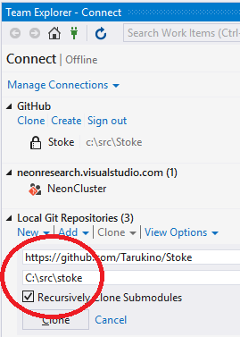
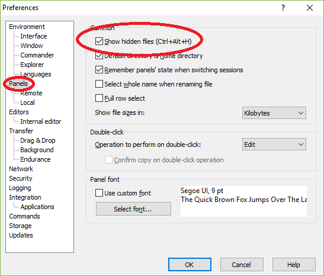

# neonFORGE
The neonFORGE, LLC technology stack.
## Workstation Requirements
* Windows 10 Professional (64-bit) with at least 16GB RAM
* Visual Studio Community Edition

Note that the build environment currently assumes that only one Windows user will be acting as a developer on any given workstation.  Developers cannot share a computer.
## Workstation Configuration
Follow steps below to configure a development or test workstation.
1. Make sure that Windows is **fully updated**.

2. I highly recommend that you configure Windows to display hidden files:

  * Press the **Windows key** and run **File Explorer**
  * Click the **View** tab at the top.
  * Click the **Options** icon on the right and select **Change folder and search options**.
  * Click the **View** tab in the popup dialog.
  * Select the **Show hidden files, folders, and drives** radio button.
  * Uncheck the **Hide extensions for known types** check box.

3. Some versions of Skype listen for inbound connections on ports **80** and **443**.  This will interfere with services we'll want to test locally.  You need to disable this:

  * In Skype, select the **Tools/Options** menu.
  * Select the **Advanced/Connection** tab on the left.
  * **Uncheck**: Use **port 80 and 443** for additional incoming connections.
  
    
  * **Restart Skype**

4. Ensure that hardware virtualization is enabled in your BIOS.

5. Install **Visual Studio Community Edition 15.4.1** from [here](https://www.visualstudio.com/downloads/).  Do a full install to ensure that you have everything.  This an overkill, but it may help prevent build problems in the future.

  * Select **all workloads** on the first panel
  * Select **individual components**
  * Click to select **all components**
  * Click **Install** (and take a coffee break)

6. Create a **shortcut** for Visual Studio and configure it to run as **administrator**.  To build and run neonFORGE applications and services, **Visual Studio must be running with elevated privileges**.
7. Install .NET Framework 4.7 Developer Pack from: [here](https://www.microsoft.com/net/download/thank-you/net47-developer-pack)
8. Install **Git for Windows** with defaults from [here](https://git-scm.com/download/win).
9. Install **Docker for Windows** from [here](https://www.docker.com/products/docker#/windows).

  * Use the **Stable** channel unless you have a specific need for bleeding edge features
  * **Right-click** the Docker icon in the system tray and select **Settings...*

    
  * Select the **Shared Drives** tab and **share** the drive with the project source code
  * You'll need to enter your workstation **credentials**
  * Select the **Daemon** tab on the left and make sure that **Experimental** is **unchecked**

10. Test your Docker configuration.

  * Open a **DOS** command window.
  * Run this command: `docker pull alpine`

11. If the previous step failed with a **Network Timeout** or another error, you'll need to update Docker's network settings:

  * **Right-click** the Docker again in the system tray and select **Settings...*
  * Click **Network** on the left, select Fixed DNS Server and then **Apply**

    

12. **Clone** the source repository on your workstation:

  * Create an individual Github account [here](https://github.com/join?source=header-home) if you don't already have one
  * Have one of the neonFORGE repository administrators **grant you access** to the repository
  * Go to [GitHub](http://github.com) and log into your account
  * Go to the neonFORGE [repository](https://github.com/jefflill/neonFORGE).
  * Click the *green* **Clone or download** button and select **Open in Visual Studio**
  * A *Launch Application* dialog will appear.  Select **Microsoft Visual Studio Protocol Handler Selector** and click **Open Link**
  * Choose or enter the directory where the repository will be cloned.  This defaults to a user-specific folder.  I typically change this to a global folder to keep the file paths short.
  
    
  * Click **Clone**

13. **Close** any running instances of **Visual Studio**

14. Many server components are deployed to Linux, so you’ll need terminal and file management programs.  We’re currently standardizing on **PuTTY** for the terminal and **WinSCP** for file transfer. install both programs to their default directories:

  * Install both **WinSCP** and **PuTTY** from [here](http://winscp.net/eng/download.php) (PuTTY is near the bottom of the page)
  * Run **WinSCP* and enable **hidden file display** [WinSCP Hidden Files](/README/WinSCPHiddenFile.png)
  * *Optional*: The default PuTTY color scheme sucks (dark blue on a black background doesn’t work for me).  You can update the default scheme to Zenburn Light by **right-clicking** on the `$\External\zenburn-ligh-putty.reg` in **Windows Explorer** and selecting **Merge**
  * WinSCP: Enable **hidden files**.  Start **WinSCP**, select **Tools/Preferences...", and then click **Panels** on the left and check **Show hidden files**:
  
    

15. Configure the build **environment variables**:

  * Open **File Explorer**
  * Navigate to the directory holding the cloned repository
  * **Right-click** on **buildenv.cmd** and then **Run as adminstrator**
  * Close the DOS window when the script is finished

16. Enable PowerShell script execution via:

  `powershell Set-ExecutionPolicy -ExecutionPolicy Unrestricted -Scope CurrentUser`

18. Import the Ansible passwords used for encrypting secret files in the Git repository Import using this command (use the standard neonFORGE **DEVOPS Password** when prompted):

&nbsp;&nbsp;&nbsp;&nbsp;`neon ansible password import %NF_ROOT%\passwords.zip`

19. Restart Visual Studio and/or any command windows to pick up the change the environment variable changes above.

20. Confirm that the solution builds:

  * Run **Visual Studio** as **administrator**
  * Open **$/neonFORGE.sln** (where **$** is the repo root directory)
  * Select **Build/Rebuild** Solution

21. Install **7-Zip (32-bit)** (using the Windows *.msi* installer) from: [here](http://www.7-zip.org/download.html)

22. Install **OpenVPN** from (using the Windows Installer): [here](https://openvpn.net/index.php/open-source/downloads.html)

23. *Optional*: Install **Fiddler4** from: [here](http://www.telerik.com/download/fiddler)

24. *Optional*: Install **Notepad++** from: [here](https://notepad-plus-plus.org/download)

25. *Optional*: In Chrome, install the **Markdown Viewer** extension from: [here](https://github.com/simov/markdown-viewer)

26. *Optional*: Install **Postman** REST API tool from: [here](https://www.getpostman.com/postman)

# Git Branches and Docker Image Tagging Conventions

We're going to standardize on some conventions for managing source control branches and published Docker image tags.

## Branches

Four branches in the repo are to be used for specific purposes:

* **master:** Includes the most recent relatively stable commits.  Developers will merge any changes here after confirming that the changes appear to work.  The **master** branch should always build and pass unit tests and will generally act as the candidate for test, staging, and production releases.

* **prod:** Includes commits that will be deployed into production. 

* **stage:** Includes commits that will be deployed info a staging environment.

* **test:** Includes commits that will be deployed into a production environment.

Developers will generally have one or more branches prefixed by their first name (lowercase), e.g. *jeff*, *jeff-experimental*,...  When developers need to colloborate on a feature over an extended period of time, we'll create feature branches like *feature-coolstuff*.  Most development work will happen in a developer or feature branch.

## Docker Image Tags

The neonCLUSTER Docker registry stores to catageories of of images: **Application** and **Base** images.

Application images host custom services and other code that will tend to be modified and redeployed relatively frequently and it is important to be able to identify the source branch and commit where the application was built.  These are tagged with the branch, and UTC date, short Git commit hash like:

&nbsp;&nbsp;&nbsp;&nbsp;`my-app-image:prod-20171208-bfa4561c`

This example indicates that **my-image** was built from the Git **prod** branch on **12-08-2017** from commit **bfa4561c**.

Images built from a branch with uncommited changes or untracked files will include the `-dirty` tag suffix, like:

&nbsp;&nbsp;&nbsp;&nbsp;`my-app-image:prod-20171208-bfa4561c-dirty`

The most recent image stabe image (probably built from the **prod** branch) will also be tagged as **latest**.

Base images are used as the source for other images and are modified relatively infrequently.  Examples include like **dotnet** or **elasticsearch** that applications containers build upon.  These are tagged with the version of the underlying software plus the image build date.  This allows multiple versions of an image with the same underlying software to be persisted to a repo to ensure that it's possible to revert to an older version if necessary.  The most up-to-date image will be tagged as **latest**.  Here's an example:

&nbsp;&nbsp;&nbsp;&nbsp;`my-base-image:2.0.3-20171208`

Here's the underlying software version is **2.0.3** which was built on **12-08-2017.

## Continuous Integration

These conventions make automating builds and deployment relatively straightforward.  The basic approach is to have a CI infrastructure monitoring the **prod**, **stage**, **test**, and any other interesting branches for changes.  When a change is detected, the CI environment pulls and builds the branch including building, tagging and pushing any Docker images using the tagging conventions and then deploying the images to cluster(s) as required.

For example to publish a production change, a developer would:

1. Verify that the changes work in another branch.
2. Merge the changes into the **prod** branch.
3. Push the changes to the Git repo.
4. The CI infrastructure would build and publish the image.
5. ...or the developer would manually build and publish the image (before we get CI working).

## Cloud Environments

neonCLUSTERs can currently be deployed to Microsoft Azure.  To test this, you'll need an Azure subscription and then gather the required authentication information.  The following sections describe how to accomplish this.

## Microsoft Azure

Follow the steps below to enable an Azure account for neonCLUSTER deployments using the **neon-cli**.  You’ll need to sign up for an Azure account [here](https://azure.microsoft.com/en-us/free/), if you don’t already have one.

Then you need to create credentials the **neon-cli** will use to authenticate with Azure.  The steps below are somewhat simplified from Microsoft’s [documentation](https://docs.microsoft.com/en-us/azure/azure-resource-manager/resource-group-create-service-principal-portal).  The instructions below assume that you have full administrative rights to the Azure subscription.

1. Install the **Azure CLI** for your operating system from [here](https://docs.microsoft.com/en-us/azure/xplat-cli-install).

2. Create a text file where you’ll save sensitive application credentials.

3. Open a command window and use the command below to log into an Azure subscription.  The command may direct you to open a link in a browser and enter a code.

  `azure login`

4. Run the command below to list your Azure subscriptions.  Save the **Subscription ID** where you’ll be provisioning your neonCLUSTER to the credentials file.

  `azure account list`

5. Create the **neon-cli** application in the Azure Active Directory, specifying the new **PASSWORD** the **neon-cli** will use to log into Azure (you can use neon create password to generate a secure password):

  `azure ad app create -n neon-cli \` 
  &nbsp;&nbsp;&nbsp;&nbsp;`--home-page http://neoncluster.com \` 
  &nbsp;&nbsp;&nbsp;&nbsp;`--identifier-uris http://neoncloud.com/neon-cli \` 
  &nbsp;&nbsp;&nbsp;&nbsp;`-p PASSWORD`

6. Save the **Password** and **AppId** to the credentials file.

7. Use the command below to create the service principal, passing the **AppId** captured above:
  `azure ad sp create -a APP-ID`

8. Save the **ObjectId** returned as the **ServicePrincipalId** to the credentials file.

9. Grant the service principal owner rights to the subscription (advanced users may want to customize this to limit access to a specific resource group):

  `azure role assignment create --objectId SERVICE-PRINCIPAL-ID \` 
  &nbsp;&nbsp;&nbsp;&nbsp;`-o Contributor \` 
  &nbsp;&nbsp;&nbsp;&nbsp;`-c /subscriptions/SUBSCRIPTION-ID`

10. Run the following command and save the **TenantID** to your credentials file.  (This is the ID of your subscription’s Active Directory instance).

  `azure account show`
